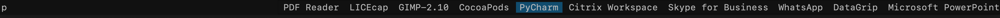
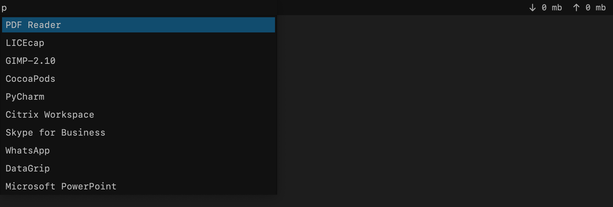

PMenu
######

Support Mac and Linux.

A small search app written in Python. It somehow simulates dmenu.

A list of items can be passed as argument and the app will graphically represent them and return the selected item.

By default if there is no list of items passed, the installed apps on the system will be displayed and selected app will be executed.

Installation
-------------

::

    $ git clone https://github.com/Radi85/pmenu.git
    $ cd pmenu
    $ ./install.sh

::

    $ pmenu -h
    usage: pmenu.py [-h] [-H APP_HEIGHT] [-i LIST_ITEM_HEIGHT] [-n LIST_MAX_ITEMS]
                [-w INPUT_WIDTH] [-l] [-sf | -ss]
                [items [items ...]]

    positional arguments:
      items

    optional arguments:
      -h, --help            show this help message and exit
      -H APP_HEIGHT, --app_height APP_HEIGHT
                            Total height of the application
      -i LIST_ITEM_HEIGHT, --list_item_height LIST_ITEM_HEIGHT
                            Item height
      -n LIST_MAX_ITEMS, --list_max_items LIST_MAX_ITEMS
                            Total number of items to be viewed in the list
      -w INPUT_WIDTH, --input_width INPUT_WIDTH
                            Width of search field
      -l, --list            Display the list vertically
      -sf, --show_fonts     Show system fonts
      -ss, --show_settings  Show parsed settings file

Usage
-----

pmenu can be used as an app's executor, additionally it can be used with other programs as a GUI's selection widget

E.g. integration with gopass_. The entries can be displayed as a list in pmenu.

.. _gopass: https://github.com/gopasspw/gopass

::

    $ gopass ls --flat | pmenu -l -n 10 | xargs gopass -c

Show available fonts in the system:

::

    $ pmenu -sf -l

Style
------

The style can be customizable by creating ``.pmenu.ini`` file in the $HOME directory or ``pmenu.ini`` in $HOME/.config/

You can find default settings in `pmenu/.pmenu.ini`_ .

.. _pmenu/.pmenu.ini: https://github.com/Radi85/pmenu/blob/master/pmenu/.pmenu.ini

PS: The installation process will copy the settings file ``.pmenu.ini`` to $HOME directory.
